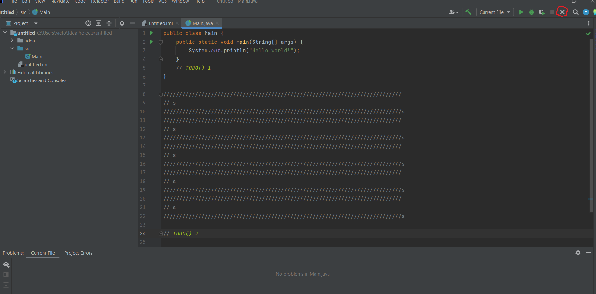
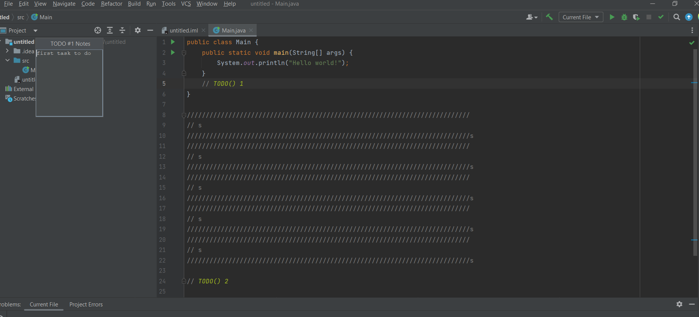
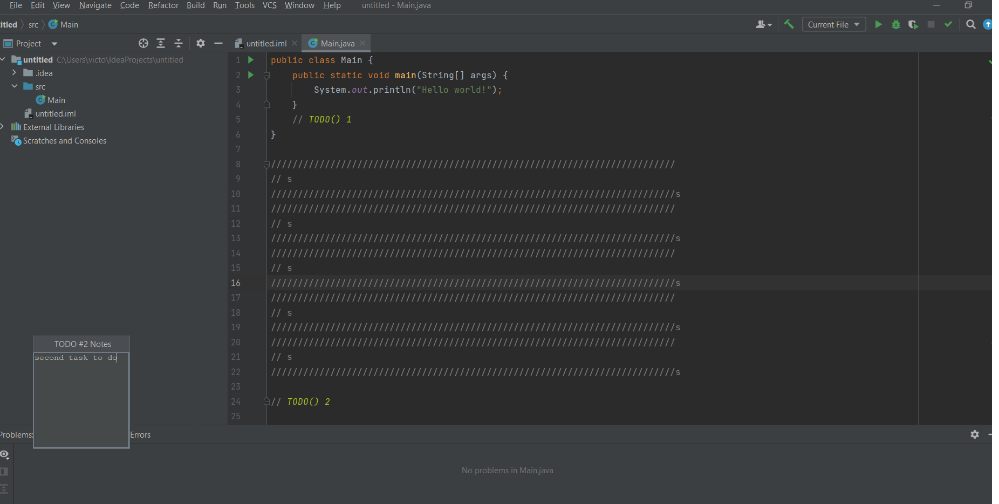

# TodoPluginKotlin

## What the plugin does and how to use it?

### 1. About the plugin

It's a plugin that help programmers to prevent writing multiple commentaries in a place.
Instead of the you mark your todo with an index like `//TODO() index` and it will pop out an text box where u can write in details what u have to do in that task.

### 2. Steps to run it

First of all, you build the code with the gradle provided or simply write in terminal `./gradle build`.
After it's build u run in gradle/intelij/runIde or `./gradle runIde`.
Then it will open a new intelij project to test the plugin.
Secondly, you will have a button on the right corner at the task bar like this: 
Just press it and the plugin is activated.
Thirdly, when u hover the text `TODO() index` it will appear a text box where u can write the tasks at that part of the code.
Here is how it looks: 

