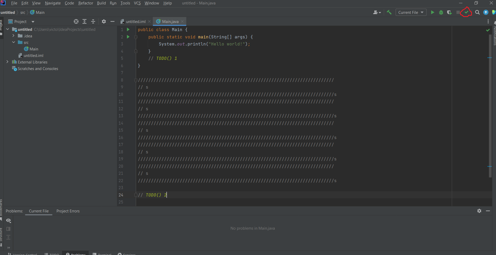

# TodoPluginKotlin

## What the plugin does and how to use it?

### 1. About the plugin

It's a plugin that help programmers to prevent writing multiple commentaries in a place.
Instead of the you mark your todo with an index like `//TODO() index` and it will pop out an text box where u can write in details what u have to do in that task.

### 2. Steps to run it

First of all, you build the code with the gradle provided or simply write in terminal `./gradle build`.
After it's build u run in gradle/intelij/runIde or `./gradle runIde`.
Then it will open a new intelij project to test the plugin.
Secondly, you will have a button on the right corner at the task bar like this: 
Just press it and the plugin is activated.
Thirdly, when u hover the text `TODO() index` it will appear a text box where u can write the tasks at that part of the code.
Here is how it looks: 

Finally to turn off just press the icon like the first step: 

### 3. Some possible bugs

When u press the start button, at first it might do nothing. Just press the turn off button and then turn it on. Now it should work.
Don't press it to fast, wait for the plugin to load in.

## How is it implemmnted?

I have 2 classes, one is TodoEditorAction and the other one is TodoHoverListener.

### 1. TodoEditorAction.kt

I extended my TodoEditorAction class with AnAction class to inherit the methods from it.
I created some sugestive variables and data structures like map to keep track of what is happening with the movment of the cursor and text box properties.
Now let's look at the methods that are overread.
`actionPerformed(event: AnActionEvent)` handles 2 cases and determinates when to turn on/off the plugin.
`update(event: AnActionEvent)` switches the icons and text icon based on the current state.
`addTodoHoverListener(editor: Editor)` adds `hoverListener` to the editor as a mouse motion listener, so the editor can respond to mouse events (more details in the TodoHoverListener class).
`removeTodoHoverListener(editor: Editor)` checks if the `hoverListener` is null and if it's not then removes the `TodoHoverListener` from the editor.
`closeAllPopups()` closes all currently open pop-ups.
`companion object` holds the reference to the icon that were used.
`data class PopupData` stores data related to a popup.

### 2. TodoHoverListener.kt

At the start it has a constructor with the variables and that structures presented in the other class. They will be modified lately.
`mouseMoved(e: EditorMouseEvent)` triggeres when the mouse moves within the editor. It checks when the `\\ TODO() index` comment appears. I used a regular expression to verify it's existance (\s means one space only, and \d+ it means number sequence).
`showEditablePopup(e: EditorMouseEvent, todoKey: String, positionOffset: Int)` displays a pop-up associated with the key from the data structure i provided. It's a way to keep account of what happens when i don't or hover the text. It also verify the index number mapped with it's text box.
`jbPopup(scrollPane: JScrollPane, textArea: JTextArea, popupTitle: String, todoKey: String): JBPopup` build and returns a pop-up window.
`closePopupWithEnter(textArea: JTextArea, todoKey: String, e: EditorMouseEvent)` saves the content wrote on the specific pop-up window then close it.

## References
`https://plugins.jetbrains.com/docs/intellij/basic-action-system.html#action-implementation`
`https://betulnecanli.medium.com/regular-expressions-regex-in-kotlin-a2eaeb2cd113`
`https://dploeger.github.io/intellij-api-doc/com/intellij/openapi/ui/popup/JBPopup.html`

